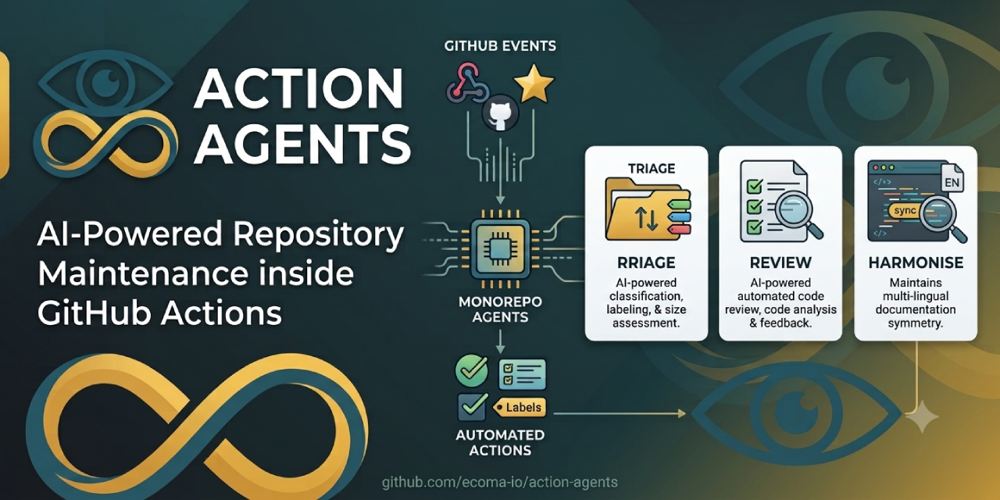

<p align="center">
  
</p>

<h1 align="center">Action Agents</h1>

<p align="center">
  <strong>AI-powered GitHub Actions for repository maintenance.</strong><br />
  Three actions, one responsibility each — triage, review, harmonise — running
  inside GitHub Actions against any OpenAI-compatible model, including one you host
  yourself. No bundle to trust, no dependency to audit, no install before they start.<br />
  <em>What the runner executes is the source you can read at the tag you pinned.</em>
</p>

<p align="center">
  <a href="https://github.com/ecoma-io/action-agents/actions/workflows/ci.yml"></a>
  <a href="https://github.com/ecoma-io/action-agents/actions/workflows/analysis.yml"></a>
  <a href="LICENSE"></a>
  <a href="https://github.com/ecoma-io/action-agents/releases"></a>
</p>

<p align="center">
  <a href="#get-started"><strong>Quick&nbsp;start&nbsp;→</strong></a> ·
  <a href="#the-actions">The&nbsp;actions</a> ·
  <a href="SECURITY.md">Security</a> ·
  <a href="CONTRIBUTING.md">Contributing</a> ·
  <a href="AGENTS.md">For&nbsp;agents</a> ·
  <a href="docs/README.md">Docs</a> ·
  <a href="https://ecoma.io">About&nbsp;Ecoma</a>
</p>

---

Repository upkeep is the work nobody schedules: labelling what arrived, reading
a diff properly, keeping the translated docs from drifting apart. A model can do
most of it — but handing a model a write token is only safe if what it may do is
bounded by something other than the prompt. These three actions draw that
boundary in code: **a model never composes an API call — it picks from a list
you wrote, and nothing that is irreversible, or that mails a human, is allowed
onto that list**, and everything read from a thread or a diff is evidence, never
instruction.

- **One action, one responsibility** — adopt `review` without adopting anything
  else. Each directory is a whole action, and nothing is shared between them but
  a small runtime layer.
- **Nothing installed on your runner** — a JavaScript action running on the
  runner's own Node 24, straight off its source. No `dist/`, no
  `node_modules`, no `npm install` step, no network before it starts.
- **Any OpenAI-compatible model** — keyed or keyless, hosted or your own. The
  chat-completions protocol is the whole of what crosses the seam, so a
  free-tier endpoint is a supported path rather than a degraded one.
- **Agentic where it earns it** — `review` decides what to read, verifies before
  it claims, and compacts its own transcript rather than truncating your diff.
- **Bounded by your workflow, not by our prompt** — configuration describes
  behaviour; the `permissions:` block is the security boundary.

> **Status: released.** Every tag is pinnable — the floating tags track the
> latest patch of their minor line, the exact tags never move — and the
> example below resolves. See [Pinning strategy](#pinning-strategy) for which
> to use; [CHANGELOG.md](CHANGELOG.md) records what shipped, when.

## Get started

```yaml
name: Review
on: pull_request

permissions:
  contents: read
  pull-requests: write

jobs:
  review:
    runs-on: ubuntu-latest
    steps:
      # review reads the working tree, so it needs a checkout
      - uses: actions/checkout@v5

      - uses: ecoma-io/action-agents/review@v0.1
        with:
          github-token: ${{ secrets.GITHUB_TOKEN }}
          api-url: ${{ vars.LLM_API_URL }}
          api-key: ${{ secrets.LLM_API_KEY }}
          model: ${{ vars.LLM_MODEL }}
```

### Pinning strategy

Every `uses:` reference takes a ref that controls what code runs. Three shapes,
in order of safety:

| Ref                  | Example                                 | What it resolves to                                                    |
| -------------------- | --------------------------------------- | ---------------------------------------------------------------------- |
| `v0.1` (floating)    | `ecoma-io/action-agents/review@v0.1`    | The latest patch release in the `v0.1` line. Gets fixes automatically. |
| `v0.1.0` (exact)     | `ecoma-io/action-agents/review@v0.1.0`  | Exactly that release. Never moves.                                     |
| `<sha>` (SHA-pinned) | `ecoma-io/action-agents/review@abc123…` | Exactly those bytes. Immutable.                                        |

Floating tags (`v0.1`, `v0.2`) deliver patches without a workflow edit — that is
usually what you want. Exact tags deliver reproducibility — that is what you
want when it is. A commit SHA delivers an audit trail — the strongest pin, and
what security policy engines enforce.

**Do not use `@main`.** A push to `main` can change what the action does at any
time, including in ways that are not yet released. Every published ref is
immutable or floating within a declared compatibility line.

Behaviour that belongs to the repository rather than to one workflow lives in
`.github/action-agents/<action>/<action>.json5` — one file per action, colocated
with its action-specific files. It is read from the default branch, so a pull request
cannot edit the policy that governs it, and every action runs without its
file: the file adds policy, it never gates execution — `harmonise` is the
exception, refusing rather than running green on nothing, for the reason its
development page carries. Prose settings — a review rubric, the language a
document is harmonised against — are markdown files the action's config file
points at, because prose belongs in a document.

## The actions

|                                          |                                                                                                                                      |
| ---------------------------------------- | ------------------------------------------------------------------------------------------------------------------------------------ |
| [**`triage`**](triage/action.yaml)       | Classifies issues and pull requests, applies semantic labels drawn from a list you declare, and assesses size.                       |
| [**`review`**](review/action.yaml)       | Reviews a pull request as an agent: it decides what to read, searches and verifies before it claims anything, and comments findings. |
| [**`harmonise`**](harmonise/action.yaml) | Keeps the multilingual versions of a repository's documentation semantically in step with one another.                               |

`review` is designed for pull requests raised from within the repository. If you
are tempted to reach for `pull_request_target` to cover forks, read
[SECURITY.md](SECURITY.md) first: checking out a fork's head under that trigger
is a vulnerability in **your** repository, and no action can fix it for you.

### The root action

The repository root contains an `action.yml`, but it is **not a runnable
action**. It exists so that `uses: ecoma-io/action-agents@v0.1.0` resolves
against a tag rather than failing with a missing-manifest error. When invoked,
it immediately fails with an error naming the three real actions and telling you
to pick one. This follows the pattern established by
[github/codeql-action](https://github.com/github/codeql-action), where the root
stub prevents accidental use of the repository as if it were a single action.

**Always reference a specific action directory** (`triage`, `review`, or
`harmonise`) in your `uses:` line.

## Documentation

|                                       |                                                                   |
| ------------------------------------- | ----------------------------------------------------------------- |
| [**Security**](SECURITY.md)           | The threat model, the ceilings, and how to report a vulnerability |
| [**Contributing**](CONTRIBUTING.md)   | Everything a pull request is judged on                            |
| [For agents](AGENTS.md)               | The same ground, for an AI agent working on this repository       |
| [Code of Conduct](CODE_OF_CONDUCT.md) | What taking part here requires                                    |

Full index: [**docs/**](docs/README.md) — written as it is earned, and honest
about which pages do not exist yet.

## Contributing

The most valuable contribution is **an action acting outside what it is
permitted to do** — a comment written that no maintainer intended, a read that
escaped the workspace, a key that reached a log. That is a security report, not
an issue: [SECURITY.md](SECURITY.md). Everything else —
[CONTRIBUTING.md](CONTRIBUTING.md) · [Code of Conduct](CODE_OF_CONDUCT.md).

## License

[Apache License 2.0](LICENSE) — © Mai Ngọc Hóa (John Martin) and the Action
Agents contributors. Apache-2.0 for its explicit patent grant.

---

<p align="center">
  <sub>
    Maintained by <a href="https://ecoma.io">Ecoma</a> ·
    <a href="https://ecoma.io">Website</a> ·
    <a href="https://github.com/ecoma-io">Github</a>
  </sub>
</p>
