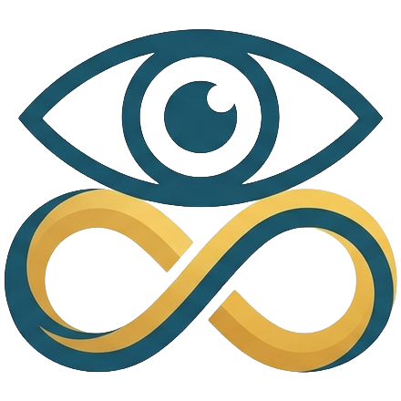

<!-- harmonise:skip-start -->
<p align="center">
  <a href="https://github.com/ecoma-io/action-agents/actions/workflows/ci.yml"></a>
  <a href="https://github.com/ecoma-io/action-agents/actions/workflows/analysis.yml"></a>
  <a href="LICENSE"></a>
  <a href="https://github.com/ecoma-io/action-agents/releases"></a>
</p>
<!-- harmonise:skip-end -->

<p align="center">
  
</p>
<h1 align="center">Action Agents</h1>

<!-- harmonise:skip-start -->
<p align="center">
<a href="README.md">English</a> | <a href="README.vi.md">Tiếng Việt</a> | <a href="README.zh.md">中文</a> | <a href="README.ja.md">日本語</a> | <a href="README.es.md">Español</a> | <a href="README.hi.md">हिन्दी</a> | <a href="README.ar.md">العربية</a> | <a href="README.pt.md">Português</a> | <a href="README.bn.md">বাংলা</a> | <a href="README.ru.md">Русский</a> | <a href="README.fr.md">Français</a>
</p>
<!-- harmonise:skip-end -->

<p align="center">
  <strong>Доверенные, ограниченные, проверяемые GitHub Actions для обслуживания репозитория.</strong><br />
  Три действия, у каждого своя ответственность — triage, review, harmonise — работают внутри GitHub Actions с любой OpenAI-compatible моделью, включая ту, что вы размещаете сами.
  Нет пакета, которому нужно доверять, нет зависимостей, которые нужно проверять, нет установки перед запуском.<br />
  <em>Что выполняет раннер — это исходный код, который вы можете прочитать на теге, который вы закрепили.</em>
</p>

<p align="center">
  <a href="docs/README.md">Документация</a> ·
  <a href="https://github.com/ecoma-io/action-agents/issues/new?template=bug_report.yml">Сообщить об ошибке</a> ·
  <a href="https://github.com/ecoma-io/action-agents/issues/new?template=feature_request.yml">Запросить функцию</a>
</p>

<p align="center">
  
</p>

Обслуживание репозитория — это работа, которую никто не планирует: назначить метки тому, что пришло, прочитать diff как следует, не дать переводам документации разойтись. Модель справится с большинством этого — но давать модели токен записи безопасно только тогда, когда её возможности ограничены чем-то помимо промпта. Эти три действия проводят эту границу в коде: **модель никогда не составляет API-вызов — она выбирает из списка, который написали вы, и в этот список не допускается ничего необратимого или того, что отправляет письмо человеку**, а всё прочитанное из треда или diff — это улика, а не инструкция.

- **Одно действие — одна ответственность** — возьмите `review`, не беря ничего остального. Каждый каталог — это целое действие, и между ними не делится ничего, кроме небольшого слоя рантайма.
- **На вашем раннере ничего не устанавливается** — JavaScript-действие, работающее на собственном Node 24 раннера, прямо из исходников. Никаких `dist/`, никаких `node_modules`, никакого шага `npm install`, никакой сети перед запуском.
- **Любая OpenAI-compatible модель** — с ключом или без, размещённая или ваша собственная. Протокол chat-completions — это всё, что пересекает границу, поэтому бесплатный endpoint — это поддерживаемый путь, а не урезанный.
- **Агентность там, где она оправдана** — `review` сам решает, что читать, проверяет, прежде чем утверждать, и сжимает собственный протокол вместо того, чтобы обрезать ваш diff.
- **Ограничено вашим workflow, а не нашим промптом** — конфигурация описывает поведение; блок `permissions:` — это граница безопасности.

> **Статус: выпущено.** Каждый тег можно закрепить — плавающие теги отслеживают последний патч своей минорной линии, точные теги никогда не двигаются — и пример ниже разрешается. Смотрите [Pinning strategy](#pinning-strategy), какой использовать; [CHANGELOG.md](CHANGELOG.md) фиксирует, что и когда выпущено.

## Get started

```yaml
name: Review
on: pull_request

permissions:
  contents: read
  pull-requests: write

jobs:
  review:
    runs-on: ubuntu-latest
    steps:
      # review reads the working tree, so it needs a checkout
      - uses: actions/checkout@v5

      - uses: ecoma-io/action-agents/review@v0.12
        with:
          github-token: ${{ secrets.GITHUB_TOKEN }}
          api-url: ${{ vars.LLM_API_URL }}
          api-key: ${{ secrets.LLM_API_KEY }}
          model: ${{ vars.LLM_MODEL }}
```

### Pinning strategy

Каждая ссылка `uses:` принимает ref, определяющий, какой код выполняется. Три формы, в порядке возрастания безопасности:

| Ref                  | Example                                 | What it resolves to                                                     |
| -------------------- | --------------------------------------- | ----------------------------------------------------------------------- |
| `v0.12` (floating)   | `ecoma-io/action-agents/review@v0.12`   | The latest patch release in the `v0.12` line. Gets fixes automatically. |
| `v0.12.0` (exact)    | `ecoma-io/action-agents/review@v0.12.0` | Exactly that release. Never moves.                                      |
| `<sha>` (SHA-pinned) | `ecoma-io/action-agents/review@abc123…` | Exactly those bytes. Immutable.                                         |

Плавающие теги (`v0.10`, `v0.11`, `v0.12`) приносят патчи без правки workflow — обычно это то, что вам нужно. Точные теги дают воспроизводимость — это то, что нужно, когда нужна она. SHA коммита даёт след для аудита — самый сильный пин, который применяют движки политик безопасности.

**Не используйте `@main`.** Пуш в `main` может изменить поведение действия в любой момент, включая способы, которые ещё не выпущены. Каждый опубликованный ref неизменяем или плавает в пределах объявленной линии совместимости.

Поведение, относящееся к репозиторию, а не к отдельному workflow, живёт в `.github/action-agents/<action>/<action>.json5` — один файл на действие, рядом с его специфичными файлами. Он читается из **разрешённого источника политики** действия — ветка по умолчанию на большинстве событий, базовая ветка pull request на pull request — по неизменяемому SHA коммита, так что pull request не может править политику, которая им управляет, а пуш, приземлившийся в середине запуска, не может изменить то, что запуск читает на полпути. Каждое действие работает без своего файла: файл добавляет политику, он никогда не блокирует выполнение — `harmonise` — исключение: он отказывается, а не работает вхолостую, по причине, указанной на его странице разработки. Текстовые настройки — рубрика ревью, язык, с которым документ гармонизируются, — это markdown-файлы, на которые указывает конфиг действия, потому что прозе место в документе.

## The actions

|                                          |                                                                                                                                                                                                                                              |
| ---------------------------------------- | -------------------------------------------------------------------------------------------------------------------------------------------------------------------------------------------------------------------------------------------- |
| [**`triage`**](triage/action.yaml)       | Классифицирует issues и pull requests по таблице меток, которую вы объявляете; ограниченная оценка модели питает детерминированную политику, которая решает мутацию — метки и один комментарий, ничего больше — а размер измеряется от diff. |
| [**`review`**](review/action.yaml)       | Ревьюит pull request как агент: он сам решает, что читать, ищет и проверяет, прежде чем что-либо утверждать, и комментирует находки.                                                                                                         |
| [**`harmonise`**](harmonise/action.yaml) | Держит многоязычные версии документации репозитория в смысловом соответствии друг с другом.                                                                                                                                                  |

`review` спроектирован для pull request, поднятых изнутри репозитория. Если вам хочется взяться за `pull_request_target`, чтобы покрыть форки, сначала прочтите [SECURITY.md](SECURITY.md): checkout головы форка под этим триггером — это уязвимость **в вашем** репозитории, и никакое действие не исправит её за вас.

### The root action

В корне репозитория лежит `action.yml`, но это **не запускаемое действие**. Он существует, чтобы `uses: ecoma-io/action-agents@v0.12.0` разрешалось в тег, а не падало с ошибкой отсутствующего манифеста. При вызове он немедленно падает с ошибкой, называющей три настоящих действия и говорящей выбрать одно. Это следует образцу, установленному [github/codeql-action](https://github.com/github/codeql-action), где корневая заглушка предотвращает случайное использование репозитория как единого действия.

**Всегда ссылайтесь на конкретный каталог действия** (`triage`, `review` или `harmonise`) в строке `uses:`.

## Documentation

|                                       |                                                            |
| ------------------------------------- | ---------------------------------------------------------- |
| [**Security**](SECURITY.md)           | Модель угроз, ограничения и как сообщить об уязвимости     |
| [**Contributing**](CONTRIBUTING.md)   | Всё, по чему оценивается pull request                      |
| [For agents](AGENTS.md)               | Та же тема, для AI-агента, работающего с этим репозиторием |
| [Code of Conduct](CODE_OF_CONDUCT.md) | Что требуется от участников                                |

Полный указатель: [**docs/**](docs/README.md) — написано по мере появления и честно о том, каких страниц пока нет.

## Contributing

Самый ценный вклад — это **действие, действующее за пределами того, что ему разрешено**, — комментарий, который не задумывал ни один мейнтейнер, чтение, вырвавшееся за пределы workspace, ключ, попавший в лог. Это отчёт о безопасности, а не issue: [SECURITY.md](SECURITY.md). Всё остальное — [CONTRIBUTING.md](CONTRIBUTING.md) · [Code of Conduct](CODE_OF_CONDUCT.md).

## License

[Apache License 2.0](LICENSE) — © Mai Ngọc Hóa (John Martin) и участники Action Agents. Apache-2.0 за прямую патентную лицензию.
